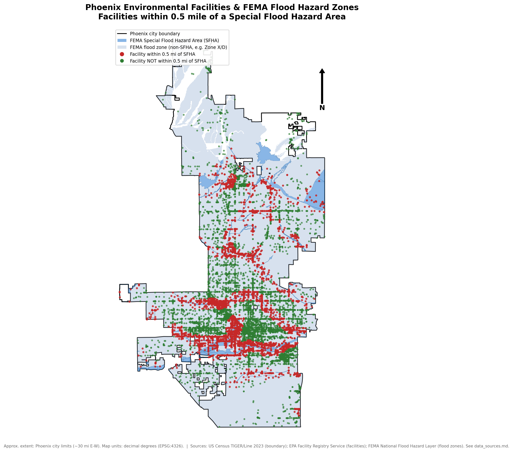

# Phoenix Environmental & Flood Risk GIS Analysis

A reproducible, Python/GeoPandas-based GIS analysis identifying EPA-registered
environmental facilities in Phoenix, Arizona that fall within 0.5 mile of a
FEMA-mapped flood hazard zone. Built as a portfolio project to demonstrate
entry-level GIS Analyst skills.

## Goal

Identify environmental facilities in Phoenix / Maricopa County that fall
within or near FEMA flood hazard zones, and produce clean GIS outputs, a
static map, an interactive web map, and a short technical report -- all
computed from real public data, with no fabricated numbers.

## Why This Project Matters

Flooding can mobilize contaminants stored or handled at industrial and
regulated facilities (hazardous waste, wastewater discharge, chemical
storage, etc.), turning a flood event into a secondary environmental
release event. A simple, defensible proximity screen -- "which regulated
facilities sit near a mapped floodplain?" -- is a realistic first step an
environmental or emergency-management GIS analyst might be asked to produce,
before a more detailed engineering study.

## Tools Used

- **Python** (pandas, GeoPandas, Shapely, PyProj) for data wrangling and
  spatial analysis
- **Matplotlib** for the static print map
- **Folium** for the interactive web map
- **ReportLab** for the PDF report
- **Jupyter** for exploratory QA/QC
- **QGIS** (manual desktop steps, see below) for visual inspection and
  attribute-table review of the final outputs

## Data Sources

| Layer | Source | Format |
|---|---|---|
| Phoenix city boundary | US Census Bureau TIGER/Line Places (2023) | Shapefile (zipped) |
| Environmental facilities | EPA Facility Registry Service (FRS), Arizona state-combined CSV bulk download | CSV |
| Flood hazard zones | FEMA National Flood Hazard Layer (NFHL), ArcGIS REST MapServer (Layer 28) | GeoJSON (via REST query) |

Full details -- exact URLs, access dates, fields used, CRS, and every
access limitation/workaround discovered while building this -- are in
[data_sources.md](data_sources.md). Notably, the EPA FRS REST API's spatial
query was found to reject any request wide enough to cover Phoenix (a
"process limit" error), so this project uses EPA's own documented bulk CSV
download instead -- see data_sources.md for the full story.

## Workflow

```
fetch_data.py   -> data/raw/         (download raw sources)
clean_data.py   -> data/processed/   (validate, reproject, spatially filter to Phoenix)
analysis.py     -> data/processed/   (buffer, spatial join, summary stats)
make_maps.py    -> maps/             (static PNG + interactive Folium HTML)
make_report.py  -> reports/          (PDF technical report)
```

Each step reads only from files written by the previous step (or from
`config.py`) -- there is no hidden state.

## How to Install

```bash
python3 -m venv .venv
source .venv/bin/activate          # Windows: .venv\Scripts\activate
pip install -r requirements.txt
```

## How to Run the Full Pipeline

```bash
python run_pipeline.py
```

This runs all five steps in order and prints a final list of every
generated output file. Individual steps can also be run on their own
(e.g. `python scripts/analysis.py`) as long as the earlier steps have
already produced their inputs.

## Outputs Generated

- `data/processed/phoenix_boundary.gpkg` -- cleaned Phoenix boundary
- `data/processed/epa_facilities_phoenix.gpkg` -- EPA facilities within Phoenix
- `data/processed/fema_flood_zones_phoenix.gpkg` -- FEMA flood zones clipped to Phoenix
- `data/processed/facilities_analyzed.gpkg` -- facilities + flood-risk flag/type
- `data/processed/facility_buffers.gpkg` -- 0.5-mile facility buffer polygons
- `data/processed/summary_statistics.csv` -- every summary number, computed at run time
- `maps/final_map.png` -- static print-quality map
- `maps/interactive_map.html` -- interactive Folium web map
- `reports/gis_summary.pdf` -- 2-page technical report

## Summary of Findings

(Exact numbers are computed live by `analysis.py` and written to
`data/processed/summary_statistics.csv` -- the figures below reflect the
most recent pipeline run and will regenerate identically from the same raw
data.)

- 10,265 EPA-registered environmental facilities were identified within the
  Phoenix city boundary (out of ~52,700 statewide FRS facilities with valid
  coordinates).
- 4,205 of those facilities (41.0%) fall within 0.5 mile of a FEMA Special
  Flood Hazard Area (SFHA).
- The largest facility categories are "Other / State-Registered Facility"
  and "Hazardous Waste (RCRA)"; these two categories also dominate the
  facilities located within 0.5 mile of a FEMA SFHA.

## Final Map Preview



- Static map: [`maps/final_map.png`](maps/final_map.png)
- Interactive map: [`maps/interactive_map.html`](maps/interactive_map.html)
- PDF report: [`reports/gis_summary.pdf`](reports/gis_summary.pdf)
- Processed GIS layers: [`data/processed/`](data/processed/)

## CRS / Projection Notes

- **Storage & web mapping:** EPSG:4326 (WGS84 geographic/lat-lon).
  Folium/Leaflet requires geographic coordinates, so this is also the
  format used for the interactive map.
- **Buffering & distance analysis:** EPSG:2223 (NAD83 / Arizona Central
  State Plane, US feet), a projected CRS centered on the Phoenix metro
  area. Buffering in EPSG:4326 would be wrong: a degree of longitude
  covers a different real-world distance depending on latitude, so a
  "0.5-degree" buffer isn't 0.5 miles anywhere, and isn't even a
  consistent distance across the study area. All distance math happens in
  the projected CRS, and results are reprojected back to EPSG:4326 for
  storage/display.

## Data Quality & Limitations

- ~7,000 statewide FRS records were dropped for missing, out-of-range, or
  `(0, 0)` sentinel coordinates before any spatial analysis.
- Facility "category" is a simplified relabeling of EPA's raw
  `PGM_SYS_ACRNMS` program-enrollment codes (e.g. RCRAINFO, NPDES, TRIS),
  not an official EPA facility-type taxonomy.
- "Flood risk" here means proximity (within 0.5 mile) to a FEMA Special
  Flood Hazard Area polygon -- it is a screening-level proximity analysis,
  not a hydraulic/engineering flood risk assessment. It does not account
  for elevation, drainage infrastructure, or levees.
- FEMA flood maps are periodically revised and may not reflect the most
  current conditions.
- See [data_sources.md](data_sources.md) for the full list of access
  limitations and workarounds encountered.

## What I Would Improve With More Time

- Incorporate facility-level hazardous substance/quantity data (e.g. TRI
  release volumes) to weight risk beyond simple proximity.
- Add a digital elevation model (DEM) to assess relative facility
  elevation within flood zones, rather than relying on 2D proximity alone.
- Extend the analysis to all of Maricopa County using county parcel/zoning
  GIS layers.
- Automate a periodic re-run against updated FEMA/EPA data so the analysis
  stays current.

## Interview Talking Points

- **Real, documented data sourcing under real constraints:** the EPA FRS
  REST API's spatial query silently rejects any request wide enough to
  cover Phoenix; I found and used EPA's own bulk CSV download instead, and
  documented why in `data_sources.md`.
- **CRS discipline:** I can explain, concretely, why buffering in a
  geographic CRS (degrees) gives the wrong answer, and which projected CRS
  I chose and why (EPSG:2223, State Plane feet, appropriate for the
  Phoenix area).
- **Spatial joins over string matching:** facilities were filtered to
  Phoenix using real point-in-polygon containment against the boundary
  polygon, not by matching a `CITY_NAME` text field, which is more robust
  to address/city-limit mismatches.
- **Reproducibility:** the entire analysis regenerates from
  `python run_pipeline.py` against live public data sources -- nothing is
  hardcoded, and every number in the report is read from a CSV the
  analysis itself produced.
- **Honest about limitations:** this is a screening-level proximity
  analysis, and I can describe exactly what it does and doesn't account
  for (hydraulics, elevation, substance quantities).

## Manual QGIS Steps (to genuinely practice desktop GIS)

The Python pipeline produces all the GIS layers as GeoPackage (`.gpkg`)
files in `data/processed/`. After running the pipeline, perform these
steps yourself in QGIS Desktop to build real, hands-on familiarity:

1. Open QGIS and start a new project.
2. Use **Layer > Add Layer > Add Vector Layer** to load, in this order:
   - `data/processed/phoenix_boundary.gpkg`
   - `data/processed/fema_flood_zones_phoenix.gpkg`
   - `data/processed/facilities_analyzed.gpkg`
   - `data/processed/facility_buffers.gpkg`
3. Open each layer's **Attribute Table** (right-click layer > Open
   Attribute Table) and inspect the fields (e.g. `intersects_flood_zone`,
   `flood_zone_type`, `facility_category`).
4. Right-click each layer > **Properties > Information** to confirm its
   CRS (should read `EPSG:4326 - WGS 84`).
5. Style the flood zones layer: **Properties > Symbology**, choose
   **Categorized**, classify by `is_sfha`, and pick distinct fill colors.
6. Style the facilities layer: **Categorized** symbology on
   `intersects_flood_zone`, using red for `True` and green for `False`.
7. Use **Vector > Research Tools > Select by Location** to independently
   verify the analysis -- important: select from `facility_buffers` (the
   0.5-mile buffer polygons), not the raw facility points, since the
   project's claim is "facilities *within 0.5 miles* of a FEMA SFHA," not
   "facilities directly inside one." Select features in
   `facility_buffers` that **intersect** the FEMA SFHA polygons in
   `fema_flood_zones_phoenix.gpkg` (filter that layer to `is_sfha = 'T'`
   first, or select on the whole layer and cross-check visually). Then
   open the attribute table of the selection, count the unique
   `registry_id` values, and compare that count against the
   `facilities_within_0.5mi_of_sfha` row in
   `data/processed/summary_statistics.csv` -- they should match.
8. Take a screenshot of the styled layers/legend in the QGIS canvas and
   save it as `screenshots/qgis_layers.png`.
9. Take a screenshot of an open attribute table (e.g. `facilities_analyzed`)
   and save it as `screenshots/qgis_attribute_table.png`.
10. Create a print layout: **Project > New Print Layout**, add the map,
    a legend, a title, and a north arrow, then export it
    (**Layout > Export as Image**) as `screenshots/qgis_layout_export.png`.
11. Save the QGIS project file (e.g. `phoenix_flood_gis.qgz`) in the
    project root so the styled layers and layout can be reopened later.

## Optional: ArcGIS Online Web Map

To also build a little ArcGIS Online familiarity (a common ask in GIS
Analyst job postings alongside QGIS):

1. Sign in to [ArcGIS Online](https://www.arcgis.com) (a free public
   account works).
2. Upload `data/processed/facilities_analyzed.gpkg` and
   `data/processed/fema_flood_zones_phoenix.gpkg` as hosted feature
   layers (**Content > New Item > Your device**).
3. Add both layers to a new web map, style the flood zones by `is_sfha`
   and the facilities by `intersects_flood_zone`, matching the color
   scheme used in `maps/final_map.png`.
4. Save the web map and take a screenshot as
   `screenshots/arcgis_online_webmap.png`.

Doing this honestly lets you say in an interview: "I'm familiar with
QGIS, ArcGIS Online basics, ArcGIS REST services, GeoPandas, Folium,
spatial joins, buffers, and map production" -- because you actually did
each of those things on this project.
